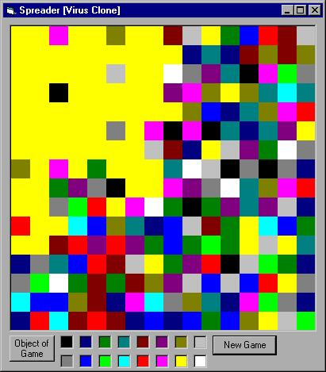



## A Spread Game \(Virus Clone\)

### Description

Designed to create a fairly simple game based on the online java game called Virus 2. I make no claim to the originality, in fact, Virus 2 can be found at: http://www.allgamesfree.com/games/

The code made to create this game does however show how to create and use Types, arrays, subroutines, nested loops, basic file I/O, testing using boolean logic, mesagebox, ToolTipText, and random numbers. cmdHelp also uses the tag property when clicked.

I hope that this may be useful for beginners or anyone who wants to make games in VB.

Very fast, with no API. Heavily commented.
 
### More Info
 

             |
---                |---
**Submitted On**   |2002-02-26 22:22:52
**By**             |[Erik Stites](https://github.com/Planet-Source-Code/PSCIndex/blob/master/ByAuthor/erik-stites.md)
**Level**          |Beginner
**User Rating**    |5.0 (15 globes from 3 users)
**Compatibility**  |VB 5\.0, VB 6\.0
**Category**       |[Games](https://github.com/Planet-Source-Code/PSCIndex/blob/master/ByCategory/games__1-38.md)
**World**          |[Visual Basic](https://github.com/Planet-Source-Code/PSCIndex/blob/master/ByWorld/visual-basic.md)
**Archive File**   |[Spread\_Gam579222272002\.zip](https://github.com/Planet-Source-Code/erik-stites-a-spread-game-virus-clone__1-32143/archive/master.zip)

